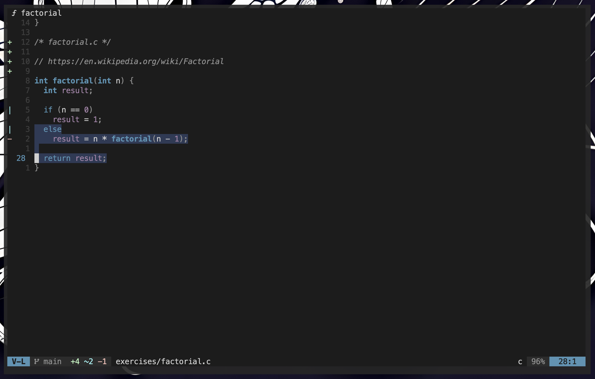
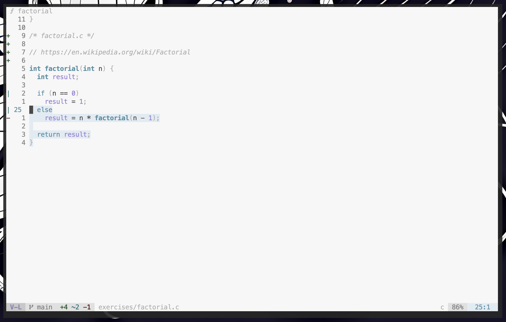
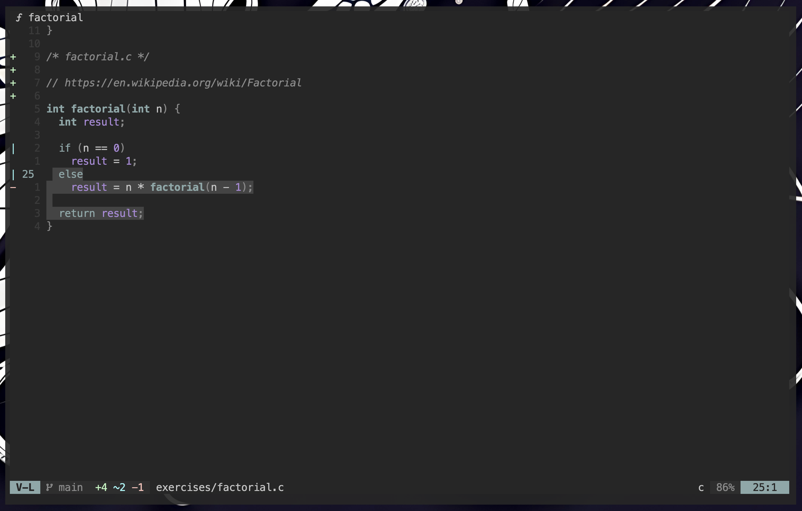
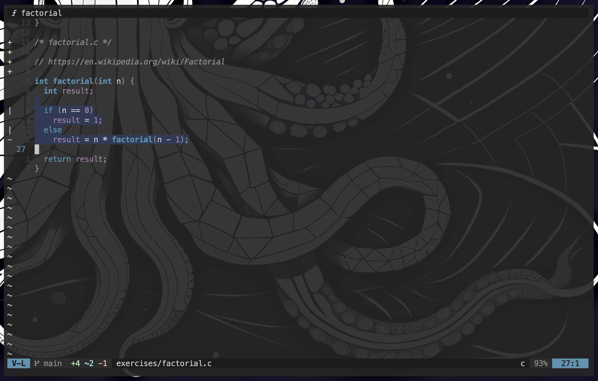
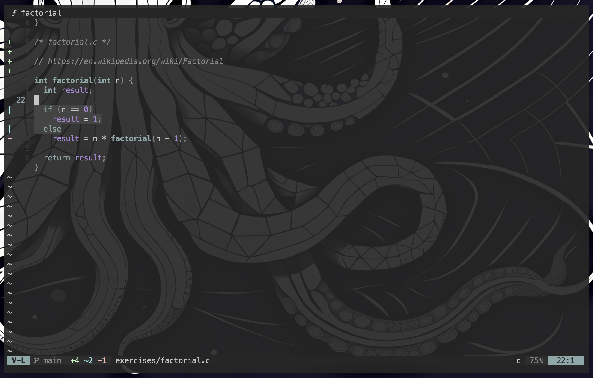

# phosmon.nvim
> A simple attempt to port [`photon.vim`](https://github.com/axvr/photon.vim) to `phosmon.nvim`

`phosmon.nvim` is a minimal, monotone (as possible) colorscheme designed for Neovim, trying to preserve the aesthetics of the original `photon.vim` theme while using the benefits of Lua.

### Installation
Using lazy.nvim:
```
{
    "downzed/phosmon.nvim",
    opts = {
        -- leave empty for default options
        mode = "dark", -- "dark" | "light" | "photon",
        transparent = false,
        ai = {
            enable = true,
            model = "codellama:latest"
        }
    },
}
```

### Usage
```
vim.cmd("colorscheme phosmon")

-- or
colorscheme phosmon
```


#### Default options
| Option | Default | Description |
| --- | --- | --- |
| `mode` | `dark` | Select between `light`, `dark`, `photon` |
| `transparent` | `false` | Enable transparent background |

### Features
`phosmon` will load some utils:
- [x] `Phosmon toggle opacity`
- [x] `Phosmon select mode`


### Integrations
- [x] light theme ~(available, but in progress)~
- [x] lualine
- [ ] more to come
- [ ] suggestions?


### Screenshots
| dark                            | light                           | photon  |
| ----------------------------------- | ----------------------------------- |----------------------------------- |
| [](./screenshots/dark.png) | [](./screenshots/light.png) | [](./screenshots/photon.png) |
| transparent dark                            |                            | transparent photon  |
| [](./screenshots/dark-trans.png) |  | [](./screenshots/photon-trans.png) |


### Contributing
Contributions are welcome! Feel free to submit issues or pull requests to enhance this port.
I probably missed something, and I'm color-blind, so be gentle.
